# WaysLeader AI 系統使用手冊

版本：2026-06-18  
適用系統：WaysLeader AI 幼兒園學習成果平台  
對象：客服人員、排課人員、主管、會計、系統管理者

本手冊依據目前系統頁面、路由、表單欄位、API 規則與實際截圖產生。截圖取自本機系統 `http://127.0.0.1:3000`，日期為 2026-06-18。截圖標示說明：① 搜尋區、② 篩選區、③ 新增按鈕、④ 匯出按鈕；若該頁沒有對應功能，章節會註明「本頁未提供」。

## 目錄

1. 系統功能總覽
2. 今日概況
3. 週課表
4. 出勤紀錄
5. 課程排班
6. 學期評量
7. 園所管理
8. 老師管理
9. 薪資計算
10. LINE 通知
11. 課程匯入
12. 園所上課報表
13. 系統設定
14. 角色操作手冊
15. 常見問題 FAQ
16. 手冊維護方式

## 系統功能總覽

WaysLeader AI 是用來管理園所課程、老師排班、出勤回報、LINE 通知、薪資計算、園所報表、學期成果與園所端成果分享的內部營運系統。主要使用流程如下：

1. 先在「老師管理」建立老師與薪資資訊。
2. 在「園所管理」建立園所資料與 LINE 綁定資料。
3. 在「課程排班」建立課程、指定老師、設定日期、課程類別與部門。
4. 每週在「週課表」查看課程安排。
5. 每日於「今日概況」確認今日課程、待回報與 LINE 未綁定。
6. 課後於「出勤紀錄」新增或修正出勤、出席人數、代課、停課與補課。
7. 老師透過 LINE 或回報頁填寫課程進度、能力培養與課堂狀況後，可在「課程進度」與園所端成果卡追蹤。
8. 園所端可查看成果卡、課程進度與學期證書；成果卡會依課程顯示對應課程熊圖，避免使用學生照片。
9. 月底由「薪資計算」匯出薪資，並由「園所上課報表」核對園所上課量、人數與課內時數。
10. 幼兒園期末可使用「學期評量」管理 AI 評語、證書與 PDF。

目前系統另有「課程進度」「代課紀錄」「器材管理」「帳號管理」「園所端入口」等延伸頁面。指定手冊章節中的「系統設定」以帳號管理為主，其他延伸功能會在相關注意事項中提示。

## 今日概況

【功能用途】

今日概況是客服與主管每天進系統的第一站，用來快速查看今日課程、今日代課、待回報數量、LINE 未綁定老師與未通知事項。下方「待回報明細」會列出近期缺出席人數或缺課程進度的紀錄。

【操作步驟】

Step 1：進入首頁「今日概況」。  
Step 2：查看上方統計卡，確認今日課程與待處理數量。  
Step 3：點選「待回報數量」或「查看更多待回報」前往出勤紀錄。  
Step 4：點選「LINE 未綁定」前往 LINE 通知管理，確認尚未綁定的老師。  
Step 5：若系統首次使用且尚無資料，可使用「匯入資料」建立初始老師與課程資料。

【畫面截圖】

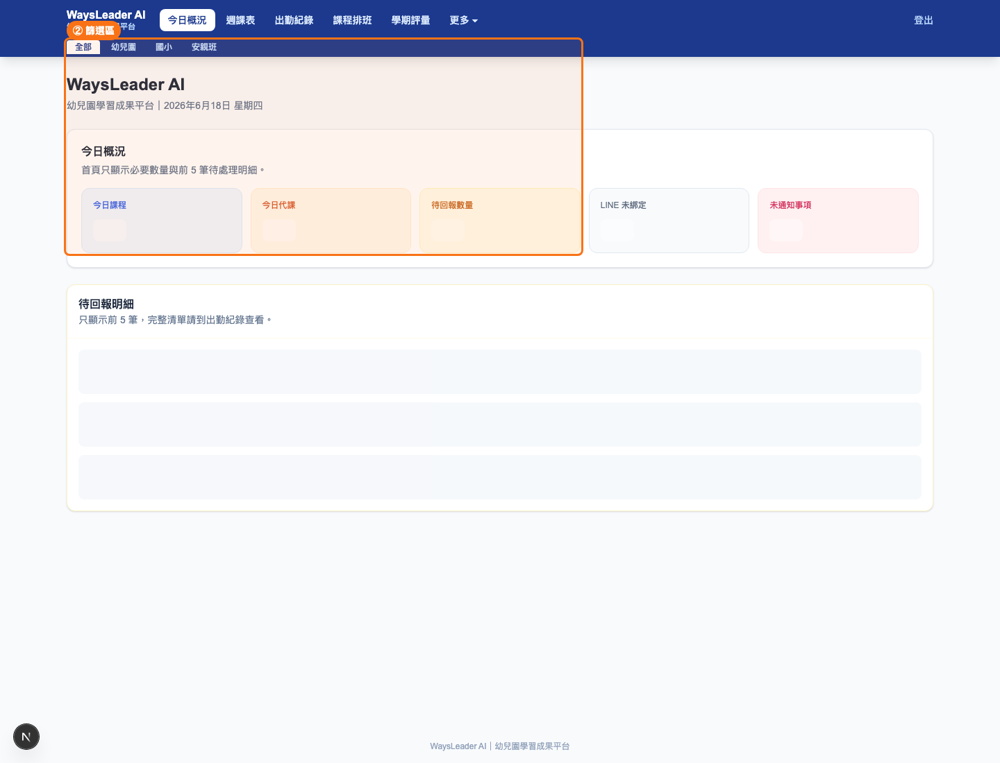

標示說明：本頁主要提供 ② 部門篩選與統計卡；本頁未提供 ① 搜尋區、③ 新增按鈕、④ 匯出按鈕。

【注意事項】

待回報只會顯示尚在回報期限內且缺資料的紀錄。課後、Demo、營隊通常需要出席人數；課內課不需要填出席人數，但仍可能需要課程進度。回報連結期限為課程結束後 48 小時。

【常見問題】

Q：為什麼課程出現在待回報？  
A：課程已結束且尚在 48 小時回報期限內，並且缺出席人數或缺課程進度。

Q：為什麼首頁沒有資料？  
A：可能該日期沒有課程、出勤紀錄尚未建立，或目前選了特定部門篩選。

## 週課表

【功能用途】

週課表用來查看一週內各日期的課程安排，排課人員可用它確認每週老師、園所、課程與地區分布。

【操作步驟】

Step 1：進入「週課表」。  
Step 2：使用「上一週」「本週」「下一週」切換週別。  
Step 3：使用地區篩選，只看特定縣市課程。  
Step 4：使用上方部門切換「全部、幼兒園、國小、安親班」。  
Step 5：確認課程卡上的日期、園所、課程、老師與時間。

【畫面截圖】

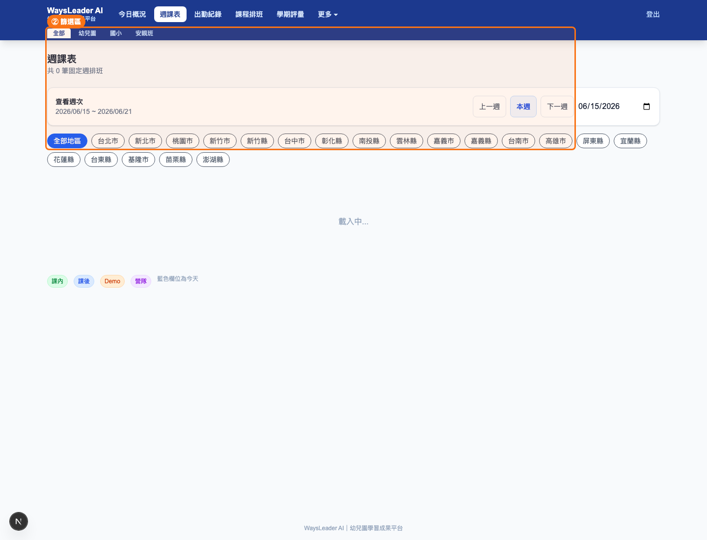

標示說明：② 篩選區包含週別、地區與部門篩選；本頁未提供 ① 搜尋區、③ 新增按鈕、④ 匯出按鈕。

【注意事項】

週課表顯示的是課程排班與實際日期資料。若課程沒有出現在週課表，請回「課程排班」確認課程是否啟用、日期是否設定、部門與地區是否被篩掉。

【常見問題】

Q：為什麼本週看不到某堂課？  
A：通常是課程未啟用、日期不在本週、部門篩選不同，或課程只設定了星期但沒有對應的實際日期規則。

## 出勤紀錄

【功能用途】

出勤紀錄用來新增與管理每次上課的實際紀錄，包含上課日期、課程、實際老師、助教、出席人數、類別、計薪時數、停課、補課與備註。客服主要用它處理待回報，會計主要用它核對薪資來源。

【操作步驟】

Step 1：進入「出勤紀錄」。  
Step 2：使用年份、月份、園所、老師、類別與狀態篩選資料。  
Step 3：點選「+ 新增上課紀錄」。  
Step 4：選擇上課日期、課程、上課老師與助教。  
Step 5：課後、Demo、營隊填出席人數；課內可免填。  
Step 6：如遇停課，勾選停課並填寫停課原因、補課日期與補課完成狀態。  
Step 7：確認計薪時數與備註後儲存。  
Step 8：需要核對時可匯出 Excel。

【畫面截圖】

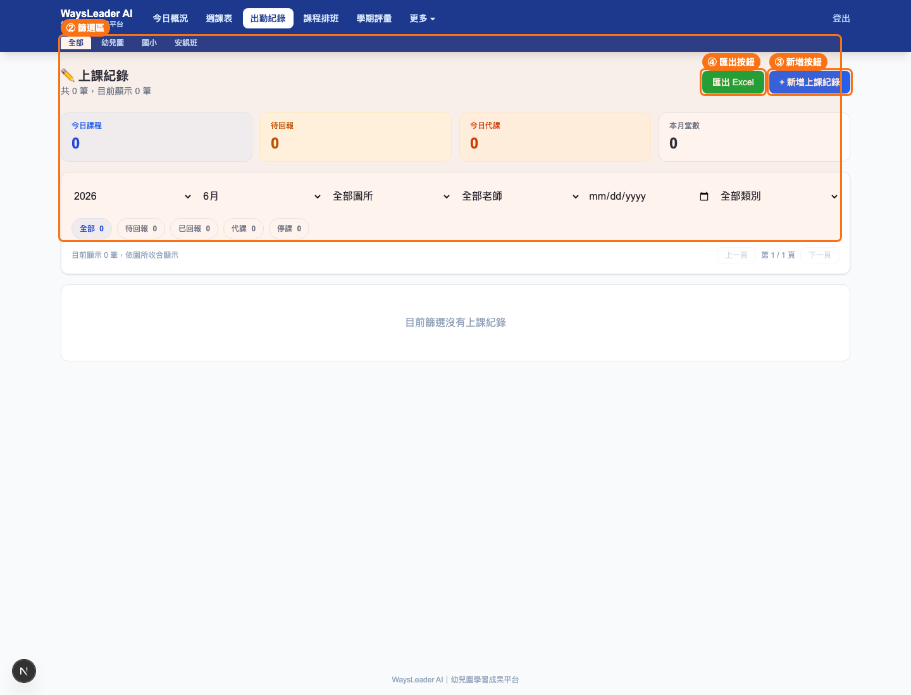

標示說明：② 篩選區包含年月、園所、老師、類別、狀態與部門篩選；③ 是新增上課紀錄；④ 是匯出 Excel。

【注意事項】

課內課不需要填出席人數，但若缺課程進度仍可能列入待回報。課後課、Demo、營隊需要填出席人數，否則會影響園所報表與待回報狀態。計薪時數會優先使用出勤紀錄的手動值，其次使用課程排班設定，最後才依上課時間估算。老師欄位代表實際上課老師，若 Course 老師已改為正式老師，符合安全條件的未回報、未鎖薪、未取消、無代課出勤會同步補成正式老師。

【常見問題】

Q：為什麼薪資沒有計算？  
A：薪資來源是出勤紀錄。若該月份沒有出勤、出勤被標記停課，或老師費率未設定，就不會出現正確薪資。

Q：代課要在哪裡改？  
A：若是由出勤產生的代課，請在出勤紀錄中修改「上課老師」；代課紀錄頁會提示這類資料需回出勤調整。

Q：為什麼出勤仍顯示待排老師？  
A：若課程已排正式老師但出勤仍是待排老師，通常是該筆出勤已回報、已鎖薪、已取消或已有代課紀錄，系統為避免覆蓋人工指定老師而跳過同步。未鎖定且未回報的安全資料可透過課程儲存或修復流程同步。

## 課程排班

【功能用途】

課程排班用來建立課程、安排老師、設定課內課與課後課、指定日期、循環課程、助教、計薪時數、部門、地區與報名人數。

【操作步驟】

Step 1：進入「課程排班」。  
Step 2：使用搜尋區搜尋課程編號、園所、課程或老師。  
Step 3：使用部門、老師、月份與地區篩選。  
Step 4：點選「+ 新增課程」。  
Step 5：選擇園所或手動輸入園所名稱。  
Step 6：填寫地區、地址、負責老師、助教、課程項目、星期、時間與計薪時數。老師欄位可直接輸入姓名搜尋，不需要從長下拉清單慢慢找。  
Step 7：選擇類別：課內、課後、Demo 或營隊。  
Step 8：設定實際上課日期：單日、多日指定、日期區間或每週循環。  
Step 9：確認課程啟用後儲存。

【畫面截圖】

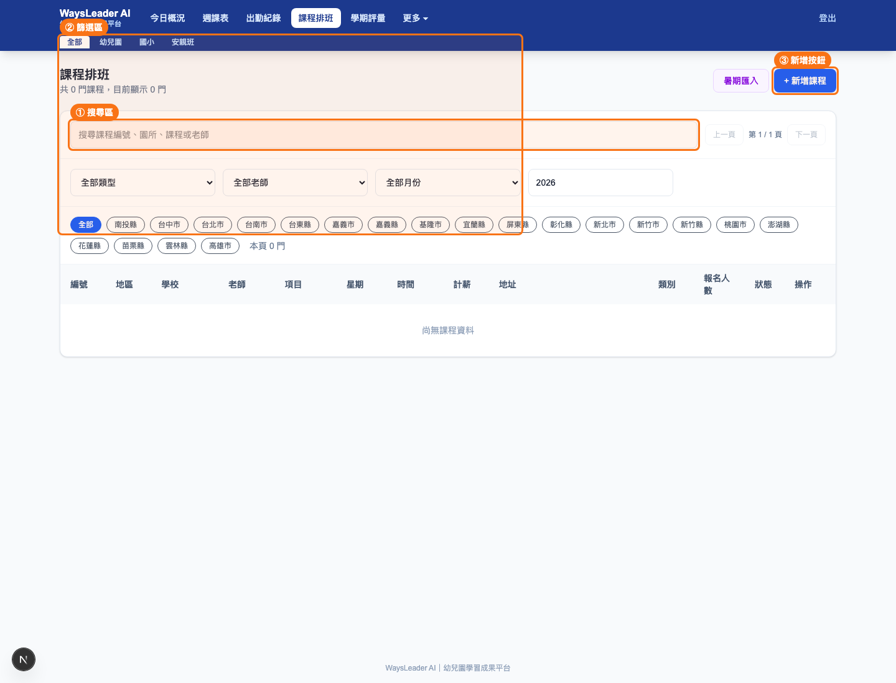

標示說明：① 是搜尋課程；② 是部門、老師、月份、地區等篩選；③ 是新增課程；本頁未提供匯出按鈕。

【注意事項】

課程編號可由系統自動產生。日期字串支援多日指定，若日期格式無法解析會提示錯誤。系統會偵測可能排課衝突，仍可由管理者確認後儲存。課程刪除會連帶影響相關出勤，若已有薪資鎖定紀錄，刪除可能被阻擋。課程主教或計薪時數變更後，系統只會同步更新未回報、未鎖薪、未取消且未人工指定/未代課的安全出勤，不會覆蓋已處理的正式紀錄。

【常見問題】

Q：課內課和課後課差在哪裡？  
A：課內課不要求出席人數；課後課、Demo、營隊需要出席人數，會影響待回報與園所人數統計。

Q：為什麼新增課程失敗？  
A：常見原因是園所或老師未填、課程編號重複、日期格式錯誤，或日期區間沒有選到有效星期。

Q：為什麼課程排班顯示 1.5h，但出勤或薪資是 1h？  
A：請先確認該筆出勤是否已回報或已鎖薪。未回報、未鎖薪、未取消的未來出勤會在課程儲存後同步 Course 計薪時數；已回報或已鎖薪資料不會被課程覆蓋，需由會計或管理者人工確認。

## 學期評量

【功能用途】

學期評量用來查看幼兒園孩子的運動評量、AI 成長評語與電子證書。可依年月、園所、課程、孩子姓名與日期篩選，並支援重新產生 AI 評語、查看或下載證書。園所端也可集中查看孩子學習成果、課程進度與證書。

【操作步驟】

Step 1：進入「學期評量」。  
Step 2：選擇年份與月份。  
Step 3：依園所、課程、孩子姓名或日期篩選。  
Step 4：查看孩子評語、平均分數與證書標題。  
Step 5：需要更新內容時點「重新產生」。  
Step 6：點「查看」或「下載 PDF」取得證書。  
Step 7：多筆資料可使用批次產生證書 / PDF。

【畫面截圖】

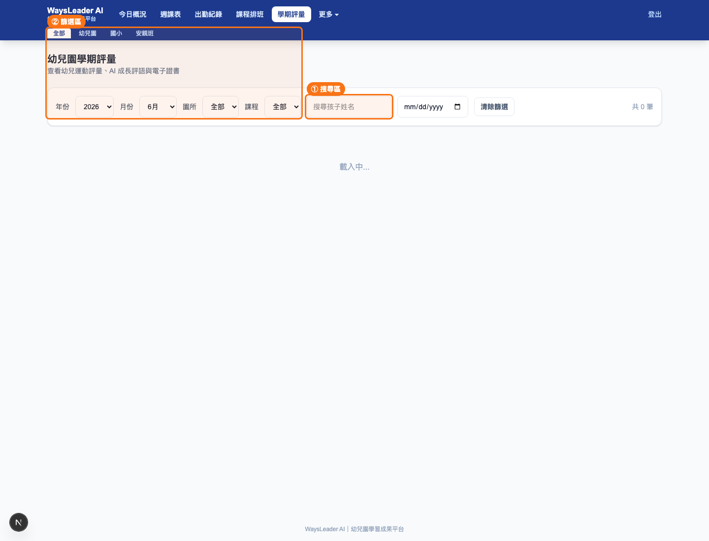

標示說明：① 是孩子姓名搜尋；② 是年月、園所、課程與日期篩選；③ 本頁沒有新增按鈕，評量通常由評量連結或出勤流程產生；④ 只有在有可批次資料或證書資料時提供 PDF 相關操作。

【注意事項】

此功能只開放幼兒園課程使用。評量儲存前需確認該課程為期末或最後一堂，否則系統會提示目前不需要學期評量。成果分享卡會優先呈現老師課堂紀錄，能力培養只顯示一次，並使用固定 8 種核心能力：專注力、團隊合作、自信心、反應力、手眼協調、肢體協調、表達力、判斷力。

【常見問題】

Q：為什麼沒有學期評量紀錄？  
A：可能該月份尚未建立評量、課程不是幼兒園部門，或該堂不是課程最後一堂。

Q：成果分享卡為什麼沒有學生照片？  
A：系統設計上避免使用學生照片，會依課程名稱顯示對應課程熊圖，例如足球、籃球、體能、體操、舞蹈、棒球、高爾夫、冰壺、街舞、注音等。

## 園所管理

【功能用途】

園所管理用來維護園所名稱、地區、類型、地址、電話、聯絡人、備註與 LINE User ID，並可複製園所端入口連結。

【操作步驟】

Step 1：進入「園所管理」。  
Step 2：使用搜尋區搜尋園所、地址、電話或聯絡人。  
Step 3：用園所類型與地區篩選。  
Step 4：點「+ 新增園所」。  
Step 5：填寫園所名稱、地區、類型、地址、電話、聯絡人與備註。  
Step 6：若園所已綁定 LINE，可填入 LINE User ID。  
Step 7：儲存後可在列表點「連結」複製園所端連結。

【畫面截圖】

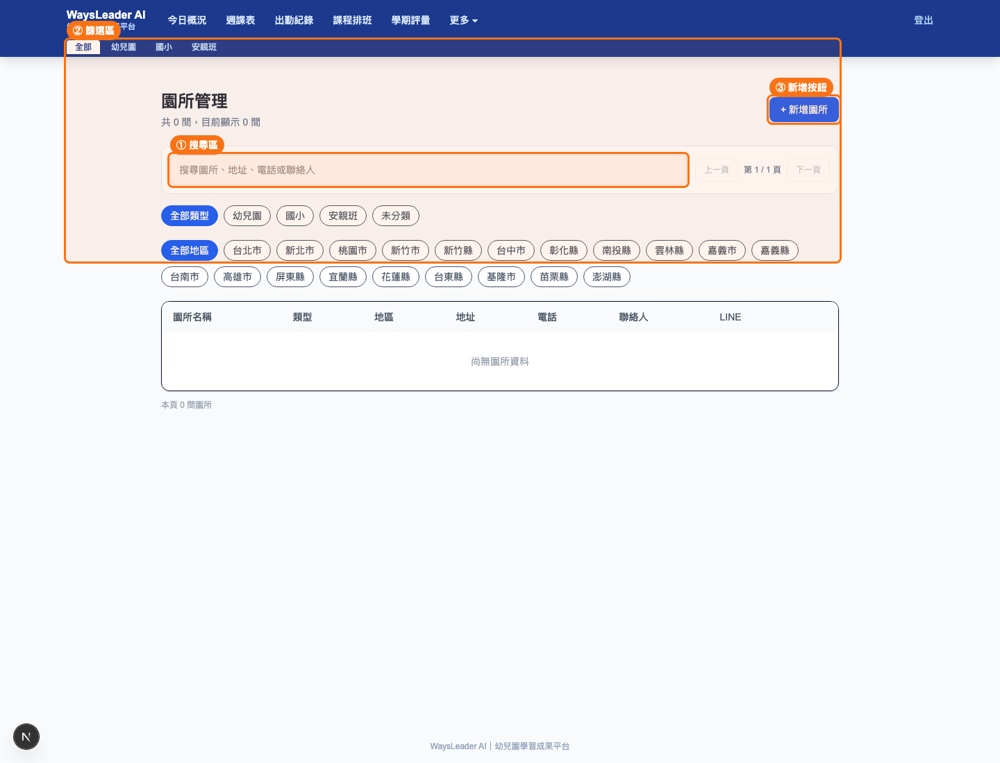

標示說明：① 是園所搜尋；② 是類型、地區與部門篩選；③ 是新增園所；本頁未提供匯出按鈕。

【注意事項】

園所名稱不可重複。LINE User ID 可由園所綁定流程產生，也可手動貼上。園所端連結會依園所 token 產生，供園所查看課程成果、學期證書與月資料。

【常見問題】

Q：如何修改園所資料？  
A：在園所列表點「編輯」，修改後按儲存。

Q：園所 LINE 無法收到通知怎麼辦？  
A：確認園所是否已綁定 LINE User ID，並確認部署環境已設定 `LINE_SCHOOL_TOKEN` 與 `LINE_SCHOOL_SECRET`。

## 老師管理

【功能用途】

老師管理用來建立老師基本資料、LINE 綁定資訊與薪資費率，包括課後時薪、課內時薪、Demo 時薪、車費、助教身份與助教費用。

【操作步驟】

Step 1：進入「老師管理」。  
Step 2：使用搜尋區搜尋老師姓名。  
Step 3：點「+ 新增老師」。  
Step 4：填寫姓名、Email、電話。  
Step 5：填寫或確認 LINE User ID 與 LINE 區域。  
Step 6：設定是否為助教。  
Step 7：設定課後、課內、Demo、車費與助教費用。  
Step 8：儲存後可在列表編輯或刪除。

【畫面截圖】

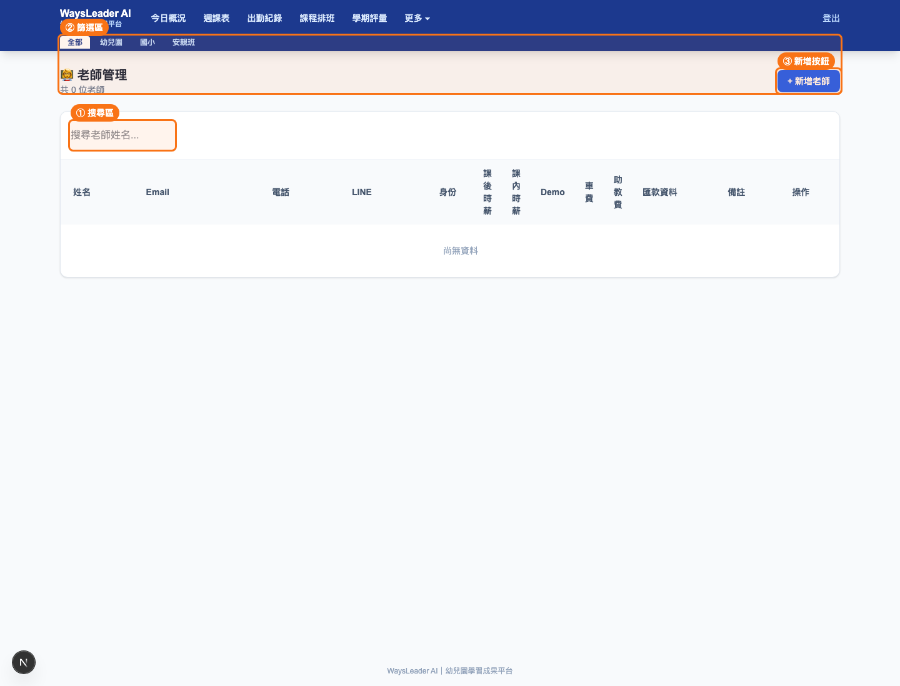

標示說明：① 是老師姓名搜尋；② 是部門與列表狀態區；③ 是新增老師；本頁未提供匯出按鈕。

【注意事項】

老師姓名不可重複。若勾選助教，薪資會使用助教費用；未勾選則依課內、課後、Demo 與車費計算。LINE 通知需要老師有 LINE User ID 與 LINE 區域。

【常見問題】

Q：如何修改老師？  
A：到「老師管理」找到老師，點「編輯」，修改資料後儲存。

Q：為什麼老師收不到 LINE？  
A：通常是尚未綁定 LINE、LINE 區域未設定，或對應 LINE Channel token 未設定。

## 薪資計算

【功能用途】

薪資計算用來依月份彙整老師薪資，包含主教時數、代課時數、助教時數、Demo、車費、總薪資、需人工確認時數，以及寄送 Email、傳送 LINE、匯出 Excel。

【操作步驟】

Step 1：進入「薪資計算」。  
Step 2：選擇年份與月份。  
Step 3：點「重新計算」。  
Step 4：切換是否顯示無課老師。  
Step 5：展開老師列查看明細。  
Step 6：核對課程、類別、身份、時間、計薪時數、時薪、車費與金額。  
Step 7：點「匯出 Excel」交給會計核對。  
Step 8：確認後可一鍵寄送 Email 或一鍵傳送 LINE。

【畫面截圖】

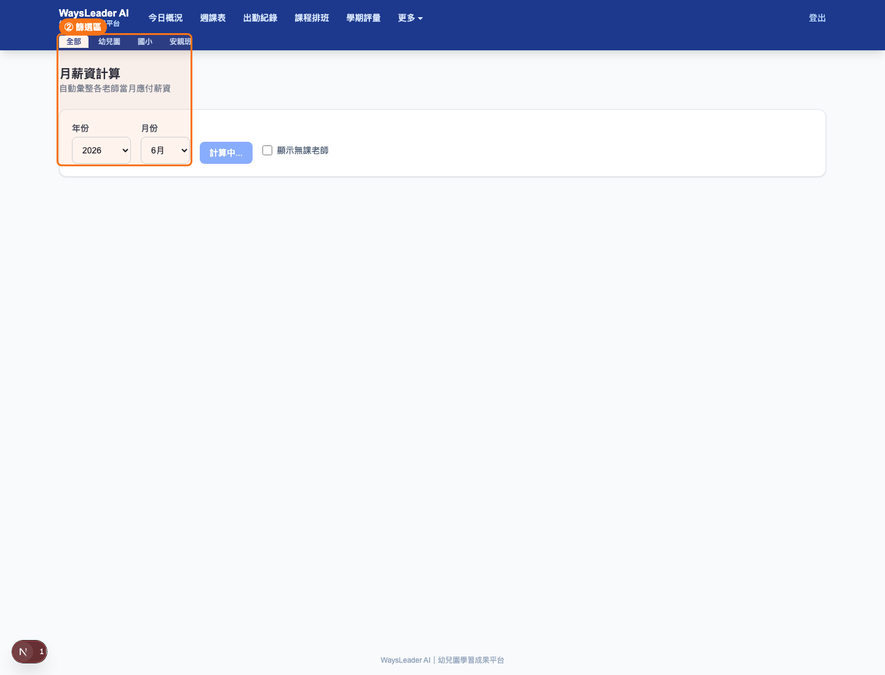

標示說明：② 是年份、月份與顯示選項；④ 是匯出 Excel；本頁沒有新增資料按鈕，薪資資料來自出勤紀錄與老師費率。

【注意事項】

薪資計算不會憑空產生資料，必須先有該月份出勤紀錄。停課不列入薪資。計薪時數優先順序為：出勤手動時數、課程排班計薪時數、上課時間估算。若時間無法估算，會標示需人工確認。薪資明細使用 Attendance 實際老師，不是只看 Course 主教，因此匯入或排班後要確認出勤老師已同步正確。

【常見問題】

Q：為什麼薪資沒有計算？  
A：請確認月份、出勤紀錄、老師費率與停課狀態。若課程時間格式不完整，請補計薪時數或修正上課時間。

Q：為什麼薪資老師或時數和課程排班對不起來？  
A：薪資以出勤紀錄為準。若 Course 已修改但 Attendance 已回報、已鎖薪或曾人工指定老師，系統不會自動覆蓋；請回出勤紀錄確認實際老師與計薪時數。

Q：為什麼 LINE 薪資條不能傳？  
A：老師沒有綁定 LINE 或沒有設定 LINE 區域時會被略過。

## LINE 通知

【功能用途】

LINE 通知管理用來管理老師與園所綁定，產生綁定碼，顯示 webhook 設定網址，發送明日課程提醒、發送課程表，以及對待回報出勤發送回報請求。

【操作步驟】

Step 1：進入「LINE 通知」。  
Step 2：先確認 webhook 設定網址：北部 OA、南部 OA、園所 OA。  
Step 3：在「老師綁定」頁籤確認未綁定老師，必要時產生綁定碼。  
Step 4：在「園所綁定」頁籤確認園所 LINE 綁定。  
Step 5：在「出勤回報」頁籤選年月，查看未回報紀錄。  
Step 6：點「發送明日課程提醒」提醒老師。  
Step 7：點「發送課程表」將課表推送給老師。  
Step 8：針對個別待回報紀錄點「請老師回報」。

【畫面截圖】

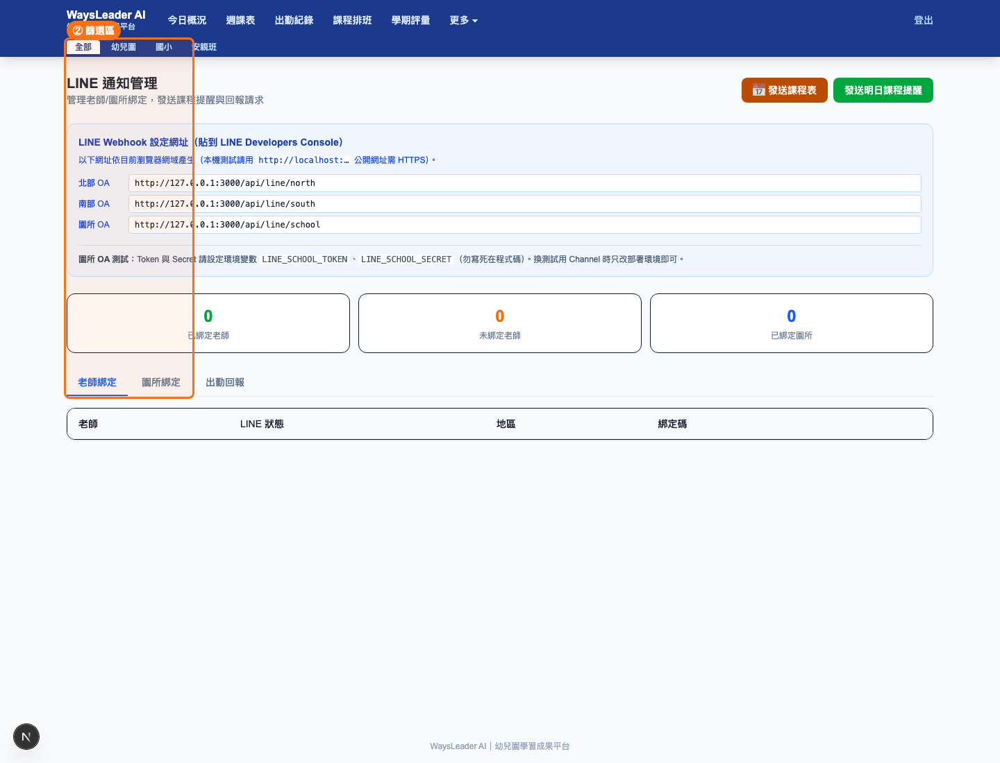

標示說明：② 是頁籤、年月與部門相關篩選；本頁的主要操作是發送與綁定，沒有通用搜尋區、沒有新增按鈕、沒有匯出按鈕。

【注意事項】

LINE 發送需要對應 Channel token。老師推播依老師的 LINE User ID 與 lineRegion 決定；園所通知依園所 LINE User ID 與 school channel token 決定。Webhook URL 必須設定在 LINE Developers Console。

【常見問題】

Q：為什麼 LINE 無法發送？  
A：常見原因是老師或園所未綁定、LINE 區域未設定、token/secret 未設定，或該筆回報已完成或超過回報期限。

Q：綁定碼要怎麼用？  
A：管理者在系統產生綁定碼後，老師或園所於 LINE 傳送該 6 位英數綁定碼，系統會把 LINE User ID 寫回資料庫。

## 課程匯入

【功能用途】

課程匯入用來批次匯入安親班暑期課程 Excel。系統會先 Dry Run 預覽，檢查新增園所、更新園所、新增課程、實際日期、老師解析、計薪時數、重複資料、日期錯誤、時間需確認、欄位缺漏與園所衝突，確認後才正式寫入。

【操作步驟】

Step 1：進入「課程匯入」。  
Step 2：選擇 `.xlsx` Excel 檔。  
Step 3：確認日期年度。  
Step 4：選擇重複資料處理模式：「略過重複資料」或「覆蓋重複資料」。  
Step 5：點「Dry Run 預覽」。  
Step 6：查看摘要卡、匯入動作預覽與問題提醒。  
Step 7：修正 Excel 中的欄位缺漏、日期錯誤、時間需確認、老師找不到與園所衝突。  
Step 8：確認 Dry Run 無必要問題後，點「確認正式匯入」。  
Step 9：匯入後回「課程排班」與「出勤紀錄」檢查老師、助教、日期與計薪時數。

【畫面截圖】

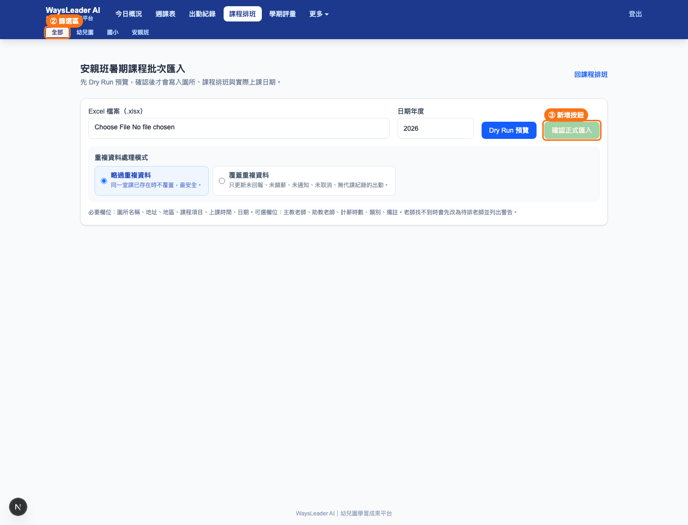

標示說明：② 是檔案、年度與流程控制區；③ 是確認正式匯入；本頁沒有搜尋區與匯出按鈕。

【注意事項】

必要欄位包含園所名稱、地址、地區、課程項目、上課時間、日期。可選欄位包含主教老師、助教老師、計薪時數、類別、備註。若 Excel 有主教老師，系統會同步寫入 Course.teacherId 與 Attendance.actualTeacherId；若有助教老師，會同步寫入助教欄位。老師找不到時該筆會先設為「待排老師」，並在 Dry Run 顯示警告。計薪時數支援小數，例如 1、1.5、2、2.5。Excel 檔若含圖片或繪圖物件，匯入會忽略圖片，只讀取表格儲存格內容。

重複資料判斷以園所名稱或 schoolId、課程項目、日期、上課時間、部門與類別為主。舊資料若 schoolId 或 address 不完整，系統會 fallback 用園所名稱避免誤判成新課程。選擇「覆蓋重複資料」時，只覆蓋未回報、未鎖薪、未轉發給園所、未取消且沒有正式代課紀錄的出勤；其他資料一律跳過並列出原因。

【常見問題】

Q：為什麼不能正式匯入？  
A：Dry Run 發現必要問題，或尚未先成功預覽。請先修正 Excel。

Q：時間需人工確認代表什麼？  
A：系統無法從時間欄推算計薪時數，匯入後需在課程或出勤補上正確時數。

Q：Excel 要給哪些欄位？  
A：最少要有園所名稱、地址、地區、課程項目、上課時間、日期。建議加主教老師、助教老師、計薪時數、類別、備註，匯入後就不用再大量手動補資料。

Q：Dry Run 顯示覆蓋，正式匯入會不會新增重複課程？  
A：Dry Run 和正式匯入使用同一套重複判斷。只要判斷為同一堂課，正式匯入會依模式略過或安全覆蓋，不會因舊資料缺 schoolId/address 就新增重複課程。

## 園所上課報表

【功能用途】

園所上課報表用來依年月、園所類型、園所與課程統計上課紀錄。主管可用它查看各園所上課量、課程分布、課內時數與課後人數；會計可用來核對園所請款與出勤資料。

【操作步驟】

Step 1：進入「園所上課報表」。  
Step 2：選擇年份與月份。  
Step 3：依園所類型、園所與課程篩選。  
Step 4：點「查詢」。  
Step 5：展開園所與課程明細。  
Step 6：確認上課日、老師、類別、出席人數或計薪時數。  
Step 7：點「匯出 Excel」輸出報表。

【畫面截圖】

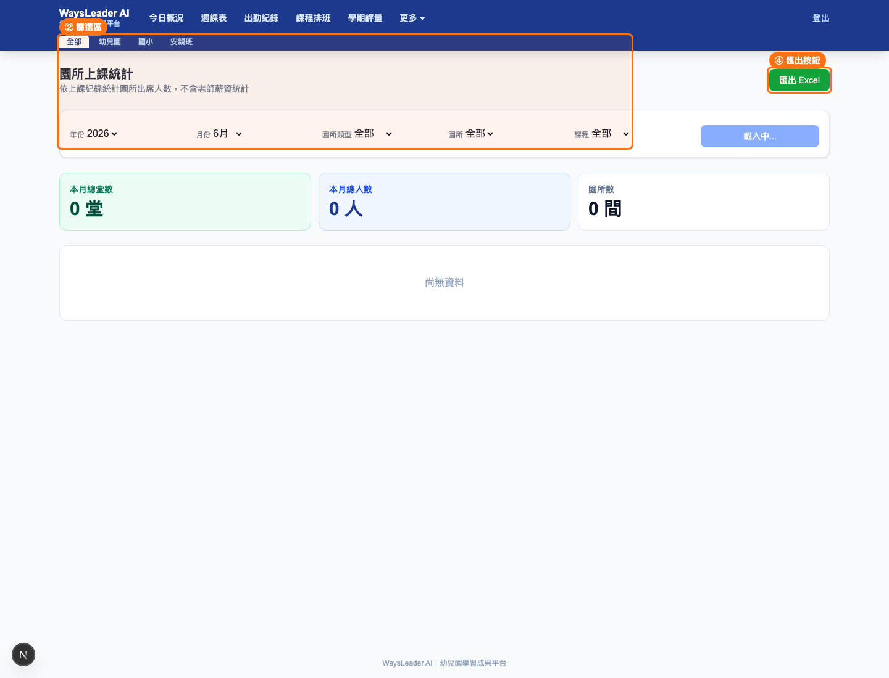

標示說明：② 是年月、園所類型、園所與課程篩選；④ 是匯出 Excel；本頁沒有新增按鈕。

【注意事項】

報表依出勤紀錄統計。課後、Demo、營隊使用出席人數；課內使用計薪時數。若出勤沒有填人數或時數需人工確認，報表會顯示未填或需確認。

【常見問題】

Q：為什麼園所報表人數不對？  
A：請回「出勤紀錄」確認該月份課後出席人數是否已填，並確認是否選錯部門、園所或課程篩選。

## 系統設定

【功能用途】

系統設定目前主要對應「帳號管理」，用來新增、編輯與停用後台登入帳號。此頁適合主管或系統管理者使用。

【操作步驟】

Step 1：從「更多」進入「帳號管理」。  
Step 2：點「+ 新增帳號」。  
Step 3：填寫帳號、姓名與密碼。  
Step 4：設定是否啟用。  
Step 5：儲存後可在列表編輯帳號。  
Step 6：離職或不再使用者可刪除或停用。

【畫面截圖】

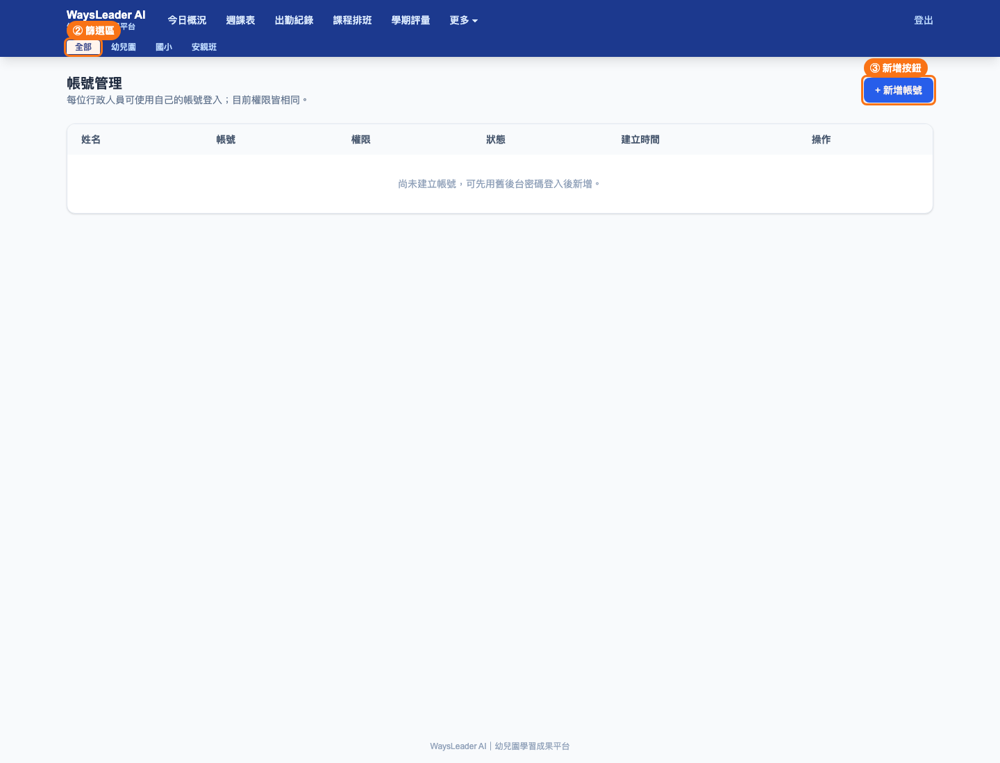

標示說明：③ 是新增帳號；本頁沒有搜尋區、匯出按鈕，篩選主要依登入與啟用狀態管理。

【注意事項】

密碼至少 4 碼。帳號用於後台登入，請避免多人共用同一組帳號。一般客服、排課、會計帳號若尚未區分角色權限，目前仍需由管理者控管使用範圍。

【常見問題】

Q：忘記帳號密碼怎麼辦？  
A：請主管或系統管理者到帳號管理重設密碼，或由開發者依資料庫流程協助。

## 角色操作手冊

### 客服人員

每天要做：

1. 查看「今日概況」的待回報數量。
2. 點進「出勤紀錄」篩選待回報。
3. 查看「LINE 通知」的未綁定 LINE 老師。
4. 對待回報老師發送提醒或請老師回報。
5. 確認停課、補課與代課資訊是否已填。
6. 如園所詢問成果，協助確認園所端連結或園所 LINE 綁定。

### 排課人員

每天要做：

1. 查看「週課表」確認本週與隔週課程。
2. 在「課程排班」建立新課程、安排老師與助教。
3. 檢查課程日期是否正確，尤其單日、多日、日期區間與每週循環。
4. 處理代課，必要時更新出勤紀錄中的實際老師。
5. 使用可搜尋老師欄位快速指定主教與助教。
6. 檢查安親班匯入後的待排老師課程、老師找不到警告與覆蓋結果。
7. 修改課程計薪時數後，確認未回報出勤已同步，已回報或已鎖薪資料需人工核對。

### 會計

每月要做：

1. 到「薪資計算」選定月份並重新計算。
2. 核對課內時數。
3. 核對課後人數與出勤是否完整。
4. 檢查需人工確認的時數。
5. 確認薪資明細的實際老師與出勤老師一致。
6. 匯出薪資 Excel。
7. 與「園所上課報表」交叉核對園所上課量。
8. 確認後寄送 Email 或 LINE 薪資條。

### 主管

每月要做：

1. 查看「園所上課報表」掌握各園所上課量。
2. 查看「學期評量」與成果證書狀態。
3. 查看「薪資計算」掌握教師時數與總薪資。
4. 查看「課程排班」確認課程成效與老師配置。
5. 檢查 LINE 綁定率與待回報率。
6. 定期檢查帳號管理，移除不再使用的帳號。

## 常見問題 FAQ

Q：為什麼課程出現在待回報？  
A：課程已結束、尚在 48 小時回報期限內，且缺出席人數或缺課程進度。課後、Demo、營隊會檢查出席人數；課內主要檢查課程進度。

Q：為什麼薪資沒有計算？  
A：請確認該月份有出勤紀錄、出勤不是停課、老師費率已設定、課程時間或計薪時數可解析。薪資不從課程排班直接產生，而是從出勤紀錄計算。

Q：為什麼 LINE 無法發送？  
A：請確認老師或園所已綁定 LINE User ID、老師有 LINE 區域、部署環境有設定對應 token/secret，並確認該回報尚未完成且未逾期。

Q：如何修改老師？  
A：到「老師管理」搜尋老師，點「編輯」，修改姓名、Email、電話、LINE、薪資費率或助教設定後儲存。

Q：如何修改園所？  
A：到「園所管理」搜尋園所，點「編輯」修改地址、電話、聯絡人、LINE User ID 或備註。

Q：課程排錯老師怎麼辦？  
A：未上課前可在「課程排班」編輯負責老師；已產生出勤或臨時代課時，請在「出勤紀錄」修改實際上課老師。

Q：課程匯入後老師為什麼是待排老師？  
A：新版匯入若 Excel 有主教老師且系統找得到老師，會帶入正式老師；若老師欄空白或姓名找不到，才會設為待排老師並在 Dry Run 顯示警告。

Q：為什麼匯入覆蓋被跳過？  
A：已回報、已鎖薪、已轉發給園所、已取消或已有正式代課紀錄的 Attendance 不會被匯入覆蓋，避免破壞人工確認過的資料。

Q：為什麼 Excel 有圖片會匯入失敗？  
A：目前匯入會忽略 Excel 圖片/繪圖，只讀表格內容。若仍失敗，請確認檔案是 `.xlsx` 並重新存檔後再上傳。

Q：園所報表為什麼顯示未填？  
A：通常是出勤紀錄缺出席人數或課內計薪時數需確認。請回出勤紀錄補資料。

Q：學期評量為什麼不能建立？  
A：此功能只開放幼兒園課程，且通常在課程最後一堂才需要評量。

Q：帳號不能登入怎麼辦？  
A：確認帳號啟用狀態、密碼是否正確。若忘記密碼，請主管或系統管理者在帳號管理重設。

## 手冊維護方式

後續功能更新時，請同步更新本手冊與 `docs/CHANGELOG.md`。

建議流程：

1. 更新系統功能後，啟動本機系統。
2. 執行 `docs/capture-manual.mjs` 重新擷取截圖。
3. 更新對應章節的功能用途、操作步驟、注意事項與 FAQ。
4. 重新產生 `docs/System-Manual.pdf`。
5. 在 `docs/CHANGELOG.md` 記錄更新日期、變更頁面與原因。
